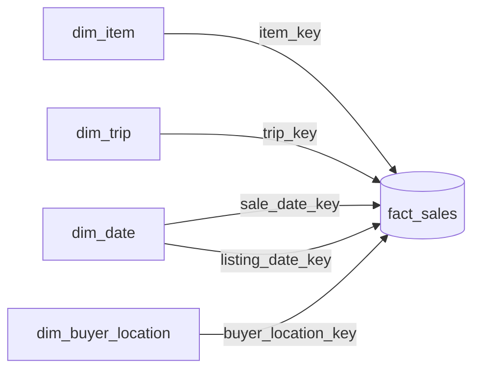

# Dimensional Model Design — Depop Sales

> This document models my Depop operational data (the trip → item → listing → sale workbook) as a dimensional star schema — how I'd structure it if I loaded it into a data warehouse for analysis.

---

## 1. Business Process, Grain & Rules

**Business event.** Sales of items on Depop. Each sale is the moment revenue is realized and fees are extracted, making it the central event for profitability analysis.

**Grain.** One row per item sold. Bundles produce multiple rows (one per item), each carrying its allocated share of shared costs. I chose this grain because the core questions of this project are inherently per-item (profit per item, days to sell, category performance); because bundles can't have their shared costs allocated correctly without per-item rows; and because a fine grain lets me roll up to order or day level whenever I want while keeping the item-level detail.

### Business rules

**Revenue**
- **Item Price** — final sale price for that specific item, as exported by Depop. Not the same as the original listed price on the Listings tab.
- **Discount Amount** — derived: `original_price (listing) − item_price (sale)`. Positive when discounted, zero when sold at list, negative if I raised the price before it sold.
- **Bundles** — each item carries its own item price; there is no separate "bundle price."

**Fee & shipping allocation** *(how shared amounts get split across bundle items for per-item reporting — separate from which amounts count toward profit, see below)*
- **Fixed costs (USPS cost, etc.)** — split evenly across all items in a bundle; a fixed package cost isn't item-dependent.
- **Percentage-based fees (Depop fee, Depop Payments fee, Buyer Marketplace Fee, boosting fee)** — split proportionally by item price, since the fees are percentage-based and proportional allocation mirrors how they were generated.

**Profit**

- **True Profit per Item** = Item Price − Allocated Fees − Item Cost
    Allocated Fees are only the fees deducted from my payout: Depop fee, Depop Payments fee, and boosting fee. Shipping is excluded (it's paid by the buyer), and the Buyer Marketplace Fee is excluded (it's charged to the buyer). Neither one comes out of what I earn, so neither belongs in profit.
- **Item Cost (Cost_Per_Sellable_Item)** — from the Trip tab: `Total_Spent / Total_To_Sell`. Kept and discarded items are real costs, so each sellable item carries its share of them.

**Transaction completeness**
- A sale appears in the export once it's been paid for, but the **payout date** is separate from the **sale date** (Depop holds funds briefly).
- A sale can be **refunded**, in which case the export shows refund information.
- A row counts as **complete** for analysis when it has a payout date and no refund. Refunded sales are excluded from profit analysis (or flagged so they can be filtered).

---

## 2. Fact Table: `fact_sales`

This table holds one row per item sold — the same grain as a single line in the Depop CSV export. Each row carries the foreign keys that connect it to its descriptive context, plus the measures used for profitability analysis.

### Foreign keys
- **item_key** → `dim_item`. Every sale is of a specific item, and the item holds the attributes I'd slice by — brand, size, category, condition, original listing price.
- **trip_key** → `dim_trip`. Every item came from a sourcing trip, and the trip carries context — date, total spent, busy level, time of day, sourcing accuracy. This lets me ask things like "do items from busy-day trips sell faster?" or "are high-yield trips more profitable?"
- **sale_date_key** → `dim_date`. Time is always a dimension. I store an integer key (e.g., `20260115`) that joins to `dim_date` rather than putting a raw date on the fact row.
- **listing_date_key** → `dim_date`. The same `dim_date` table in a second role (a *role-playing dimension*): one date for when I listed an item, one for when it sold. The gap between them is `days_to_sell`.
- **buyer_location_key** → `dim_buyer_location`. Lets me analyze geographic patterns. I skip a buyer dimension — I rarely have repeat buyers and there's nothing descriptive about the buyer worth storing.


### Additive measures
*A measure is additive if summing it across any combination of dimensions produces a meaningful number.*

| Measure | What it is | Why it's additive |
|---|---|---|
| `item_price` | Final sale price for this item | Sums across any slice → meaningful |
| `buyer_shipping_paid` | What the buyer paid for shipping (allocated for bundles) | Sums cleanly |
| `usps_cost` | Actual shipping cost (allocated evenly across bundle items) | Sums cleanly |
| `depop_fee` | Depop's commission (allocated proportionally) | Sums cleanly |
| `depop_payments_fee` | Payment processing fee (allocated proportionally) | Sums cleanly |
| `marketplace_fee` | Buyer marketplace fee (allocated proportionally) | Sums cleanly |
| `boosting_fee` | Paid promotion, if boosted (allocated proportionally) | Sums cleanly |
| `item_cost` | Cost_Per_Sellable_Item from the source trip | Sums cleanly |
| `discount_amount` | `original_price − item_price` | Sums cleanly |
| `quantity` | Always 1 at this grain; useful for `COUNT(*)`-style aggregations and bundle analysis | Sums cleanly |

### Derived measures
*Measures that are sums/differences of other measures, stored pre-computed to save the BI tool the math.*

| Measure | Formula |
|---|---|
| `gross_profit` | `item_price − depop_fee − depop_payments_fee  − boosting_fee − item_cost`  
| `total_fees` | sum of all fee columns |

### Degenerate dimensions
*Identifiers that look like dimension keys but have nothing else worth knowing about them, so they live on the fact row instead of in their own table.*
- **order_number / transaction_id** — lets me group items in one order ("show me everything in order #4521").
- **bundle_flag (Y/N)** and **bundle_item_count**.
- **refund_flag** — to filter refunded sales out of profit analysis.
- **listing_id** — kept for traceability back to the original listing (audit trail).

```
fact_sales
─────────────────────────────────────────
sales_fact_id              (surrogate PK)
-- Foreign keys
item_key                   → dim_item
trip_key                   → dim_trip
sale_date_key              → dim_date
listing_date_key           → dim_date  (role-playing)
buyer_location_key         → dim_buyer_location
payment_type_key           
-- Degenerate dimensions
order_number
listing_id
bundle_flag
bundle_item_count
refund_flag
-- Additive measures
quantity
item_price
buyer_shipping_paid
usps_cost
depop_fee
depop_payments_fee
marketplace_fee
boosting_fee
item_cost
discount_amount
-- Derived measures
gross_profit
total_fees
```

---

## 3. Dimension Tables

**`dim_item`** — holds every descriptive attribute of an item I'd ever want to filter, group, or drill on.

```
dim_item
─────────────────────────────────────────
item_key              (PK — surrogate key, auto-increment)
item_id               (natural key — my Item_ID from the workbook)
-- Descriptive attributes
description           (free-text, e.g. "pink graphic tee")
brand                 (free-text brand name)
size                  (as labeled on the item)
condition             (Brand New / Like New / Used-Excellent / etc.)
package_size          (XXS / XS / S / M / L / XL — Depop shipping tier)
status                (Keep / Sell / Discard — useful for filtering)
-- Category hierarchy (denormalized)
category              (Tops, Bottoms, Dresses, etc.)
category_group        (e.g. "Apparel - Upper Body"; optional)
brand_tier            (Fast Fashion / Mid-Market / Designer / Vintage — my classification)
-- Listing-time attributes
original_price        (from the Listings tab — what I first listed it for)
measurement_1, _2, _3, _4
measurement_labels
-- SCD tracking columns
effective_date
end_date
current_flag
```
*Why no `dim_listing`: in my operational workbook, Item and Listing are separate tabs because they capture different stages. In the dimensional model, since `fact_sales` is one row per item sold, the listing attributes (original_price, condition, package_size, measurements) collapse onto `dim_item` as descriptive context for the item as it was sold.*

**`dim_trip`** — holds the sourcing context behind each item.

```
dim_trip
─────────────────────────────────────────
trip_key                    (PK — surrogate key)
trip_id                     (natural key — my Trip_ID)
-- Trip context
trip_date
arrival_time
arrival_time_bucket         (Morning / Midday / Afternoon / Evening — derived)
day_of_week
is_weekend
busy_level                  (Low / Medium / High)
-- Trip outcomes
total_spent
time_spent_minutes
total_items
total_kept
total_to_sell
total_discarded
cost_per_sellable_item      (my derived cost floor)
sourcing_accuracy_pct       (total_to_sell / total_items)
yield_per_minute            (total_to_sell / time_spent_minutes — derived)
```
*Note: `cost_per_sellable_item` appears here as a descriptive trip attribute and also on the fact row as `item_cost` (the additive cost used in profit).*

**`dim_date`** — one row per calendar date, joined by both `sale_date_key` and `listing_date_key` (role-playing). Stored as an integer `YYYYMMDD` key, which sorts correctly and stays readable.

```
dim_date
─────────────────────────────────────────
date_key              (PK — integer YYYYMMDD, e.g. 20260115)
full_date
day_of_week / day_of_week_number
day_of_month / day_of_year
week_of_year
month_number / month_name
quarter / quarter_number
year / year_month
-- Business flags
is_weekend
is_holiday / holiday_name
-- Resale-specific flags
is_q4                 (Q4 = resale high season)
season                (Winter / Spring / Summer / Fall)
is_back_to_school     (late Aug / early Sept)
```

**`dim_buyer_location`** — one row per unique location (not per buyer), so I can group sales geographically.

```
dim_buyer_location
─────────────────────────────────────────
location_key          (PK — surrogate key)
city
state / state_abbreviation
zip_code
region                (Northeast / Midwest / South / West — US Census regions)
```

**Handling change over time (SCDs).**
`dim_item` carries `effective_date` / `end_date` / `current_flag`, which makes it a **Type 2** slowly-changing dimension. I use Type 2 so that when an item is relisted at a new price, each sale points to the version of the item that was current *at the time of that sale* — preserving the actual price-at-sale for discount and profit analysis.

---

## 4. The Star Schema & How to Use It

**Relationships**
- `dim_item` 1 → M `fact_sales`
- `dim_trip` 1 → M `fact_sales`
- `dim_date` 1 → M `fact_sales`
- `dim_buyer_location` 1 → M `fact_sales`

Every dimension connects directly to `fact_sales`; dimensions don't connect to each other.



**Grain statement.** Each row in `fact_sales` represents one item sold to one buyer in one transaction on Depop, with all bundle-level costs (shipping, fees) allocated down to the item level.

**Key measures (plain English)**
- **Item Price** — what the buyer paid for this specific item, after any discounts. For a bundle, just that item's portion, not the whole bundle total.
- **Discount Amount** — how much I came down from the original list price. Zero means it sold at list; large numbers mean it needed negotiation or markdowns to move.
- **Total Fees** — everything Depop and payment processors took out, allocated proportionally for bundles.
- **Allocated Shipping** — shipping cost split evenly across bundle items. Shipping is paid by the buyer.
- **Item Cost** — sourcing cost from the trip: total trip spend ÷ number of sellable items found. Includes the share for items I kept and discarded.
- **Gross Profit** — Item Price minus all fees and item cost. 
- **Quantity** — always 1 at the row level; useful for counting items sold across any slice.

**Common analysis patterns**
- *Total profit by month?* — group by `sale_date_key` (month), sum `gross_profit`.
- *Which categories sell fastest?* — group by `dim_item.category`, avg(`sale_date − listing_date`).
- *Do busy-day trips produce more profitable items?* — group by `dim_trip.busy_level`, avg `gross_profit`.
- *Which states do my buyers come from?* — group by `dim_buyer_location.state`, count or sum `item_price`.
- *Discount frequency by brand tier?* — group by `dim_item.brand_tier`, count where `discount_amount > 0`.
- *Sourcing ROI per trip?* — group by `trip_key`, sum `gross_profit`, compare to `dim_trip.total_spent`.

**Hierarchies**
- **Time** — year → quarter → month → week → day. 
- **Geography** — region → state → city, all in `dim_buyer_location`.
- **Item** — category → individual item. (Limited depth; my business has no department/subcategory layers.)
- **Trip** — trip date → individual trip; filter by `busy_level` or `arrival_time_bucket` to slice across similar trips.
